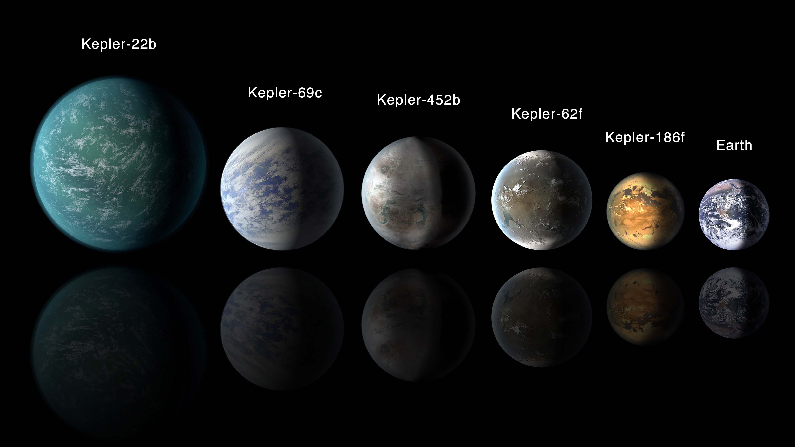

# My Task On Machine Learning  - Exoplanet Exploration

-- Assumptions and Findings.

This Assignment I have created machine learning models capable of classifying candidate exoplanets from the raw dataset obtained by the NASA Kepler space telescope .It was out on a planet-hunting mission to discover hidden planets outside of our solar system.

Source:[Exoplanet Data Source](https://www.kaggle.com/nasa/kepler-exoplanet-search-results) = exoplanet_data.csv as given.

steps involve: 

--> Reading and clening the csv data.

--> classifing the planets in three different categories and removing features that having liitle weight.

--> Creating a Train Test Split from sklearn.model_selection. 

--> Pre-processing:
 - Scaling the data using the MinMaxScaler and performing some feature selection.

--> Training the Model by using logistic regression.

--> Hyperparameter Tuning ,by using GridSearchCV to tune the model's parameters.

--> Finally save the model .

    Please follow this link  to see https://github.com/deobandana/Machine-learning-challenge